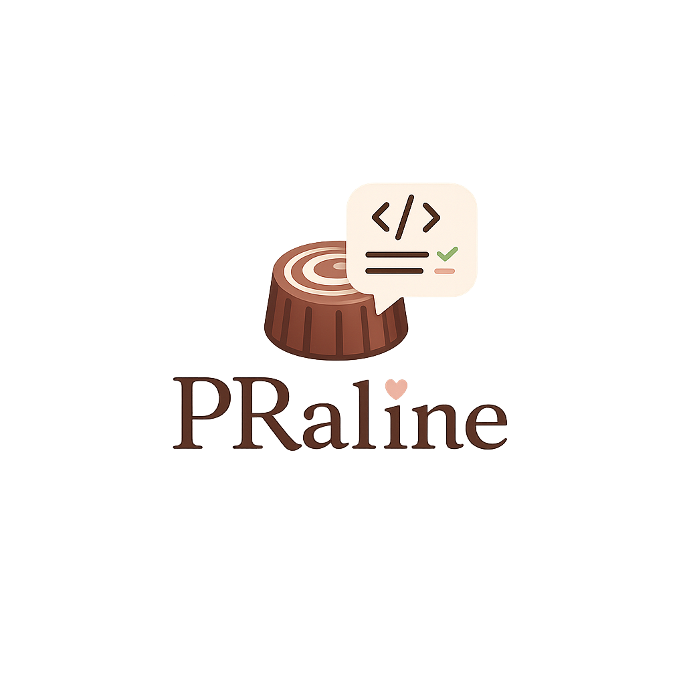

# PRaline

An interactive CLI that reviews your GitHub pull requests with Claude Code as the LLM backend. No API key needed, it rides your existing Claude Code subscription. 

This is meant as a lighter, more "human friendly" quick first review, than e.g. tools like Copilot. It also includes features such as building a human-readable knowledge base of your repo, PR by PR, and sending Slack notification when reviews are done. 


**Disclaimer:** This is fully vibe-coded

<p align="center"></p>


## What it does

- Builds a knowledge base of a repo (architecture, conventions, past PR lessons), read once from the whole codebase and kept up to date from there
- Picks an open PR and reviews its diff, aware of the existing comment thread
- Walks you through each proposed comment (accept, reject, or edit) before posting anything
- Looks as hard as you ask it to, from a handful of high-level remarks to an adversarial audit (`--hardness`)
- Writes the fix rather than only the complaint: typos and one-line mistakes come back as one-click GitHub suggestions
- Tells you what moved since you last looked: PRs opened (🆕) or updated (🔄) since your last check
- Reads a stack of PRs bottom-up, and remembers what it already said, so a re-review builds on the last one
- Ends every review with a verdict: ✅ ready to approve, 🛠️ needs minor revisions, 🚧 work in progress
- Optionally posts the result to Slack, in a group chat with the PR author and you, plus a round-up DM to you
- Puts you back on the PR's reviewer list when it's done, so approving is two clicks
- Draws the repo's module map into the HTML knowledge base, so you can see the shape of the code
- Runs as an MCP server, so you can just ask Claude to do any of the above
- Or runs unattended, watching a repo and reviewing PRs as they arrive, under a token budget you set
- Never touches code: read-only on contents, comment/issue-only on GitHub

## Quickstart

No need to clone this repo. [`uv`](https://docs.astral.sh/uv/) can run PRaline straight from GitHub:

```bash
# 1. cd into the repo you want to review
cd ~/src/some-code-repo

# 2. set your GitHub token (see Requirements below for scopes)
export GITHUB_TOKEN=github_pat_...

# 3. start reviewing PRs of the current repo
uvx --from git+https://github.com/ameroyer/PRaline praline
```

Add `--model opus` (default: `sonnet`) or `--dir /path/to/repo` to review a repo other than the current directory.

Two other ways to run it, once that works:

```bash
# let Claude drive it: "anything new on this repo?", "review PR 42 thoroughly"
claude mcp add praline -- uvx --from git+https://github.com/ameroyer/PRaline praline-mcp

# or leave it watching, reviewing PRs as they arrive (budget-capped by default)
praline monitor            # capped at 40k tokens/hour by default
```

See [Use it from Claude](#use-it-from-claude-mcp-server) and [Monitor mode](#monitor-mode).

> **⚠ Always pass `--from`.** Bare `uvx praline` resolves the name `praline` on PyPI, where it belongs to an unrelated Raspberry Pi Bitcoin wallet. You would download and run a stranger's package (and its `RPi.GPIO`, `leveldb`, `bitcoin` dependencies), not this tool. `uvx --from <source> praline` is the only safe form.

> **Note:** while this repo is private, clone it over SSH instead: `uvx --from git+ssh://git@github.com/ameroyer/PRaline praline`. Don't put a token in the URL: it lands in your shell history, in `ps` output, and in `.git/config`.

## Requirements

- Python >= 3.12
- [`claude`](https://claude.com/claude-code) CLI installed and logged in
- A GitHub personal access token stored in `GITHUB_TOKEN` or `GH_TOKEN`, scoped to:
  - Contents: read-only
  - Pull requests: read/write, for review comments and review requests
  - Issues: read/write, only because a PR's top-level comment thread is the issue-comment endpoint; PRaline never opens, closes or edits an issue
- Optional, for Slack pings: a Slack bot token with `chat:write` and `mpim:write` (see [Slack notifications](#slack-notifications))

## Usage from a local clone

Working on PRaline itself, or just prefer a checkout you control? Point `uv run --project` at the clone and `--dir` at the repo you want reviewed. The two are independent: `--project` says *which PRaline*, `--dir` says *which repo to review*.

```bash
git clone git@github.com:ameroyer/PRaline.git ~/src/praline
cd ~/src/praline && uv sync          # once

# review any repo, from anywhere
uv run --project ~/src/praline praline --dir ~/src/some-code-repo
```

Every flag and subcommand works the same way:

```bash
uv run --project ~/src/praline praline --dir ~/src/some-code-repo --model opus
uv run --project ~/src/praline praline --dir ~/src/some-code-repo --slack
uv run --project ~/src/praline praline --dir ~/src/some-code-repo check
uv run --project ~/src/praline praline --dir ~/src/some-code-repo auto 123
```

Shared flags work on either side of a subcommand: `praline --dir X check` and `praline check --dir X` are the same command.

`--dir` defaults to the current directory, so from inside the repo you are reviewing you can drop it:

```bash
cd ~/src/some-code-repo
uv run --project ~/src/praline praline
```

That is a lot to type, so alias it. That also removes any chance of reaching the unrelated PyPI package by accident:

```bash
# ~/.bashrc or ~/.zshrc
alias praline='uv run --project ~/src/praline praline'
```

Then it is just `praline`, `praline check`, `praline auto --slack`, `praline --dir ../other-repo`, and so on.

Then follow the CLI menu: build the knowledge base, see what's new, or pick a PR to review comment by comment.

## Knowledge base

Everything lives in `.praline/` inside the target repo:

| file | contents |
| --- | --- |
| `knowledge.md` | the full knowledge base, repo knowledge plus PR history |
| `knowledge.html` | the same document, styled for the browser (can be pushed as a Claude Artifact later) |
| `repo.md`, `pr_history.md` | the two halves, kept separately so each can be updated on its own |
| `graph.json` | the module map drawn at the bottom of `knowledge.html` |
| `review_log.json` | every review PRaline has done here, fed back as context (see [Review memory](#review-memory)) |
| `seen_state.json` | what was open and how fresh, as of your last check |
| `budget.json` | model spending in the current hour, when a token budget is on |

Both paths are printed every time the knowledge base is built or updated.

- The first build reads the whole codebase: Claude explores the checkout with read-only tools (`Read`, `Glob`, `Grep`) and writes up architecture, per-module reference, conventions, invariants and pain points. This takes a few minutes.
- Later updates are cheap: they work from the file listing, the recent commits and the merged PRs, feeding the previous document back in so nothing accumulated is lost.
- Updates read the repo's default branch rather than your working tree, so a stale checkout can't skew them. If your git remote's own credentials don't work (an ssh remote in a shell with no agent, typically), PRaline fetches over HTTPS with the GitHub token it already has instead of giving up. Only if both fail does it fall back to your local checkout, and it says why.
- When you pick a PR to review, PRaline checks GitHub for PRs merged since the last build and offers to refresh first.

Add `.praline/` to that repo's `.gitignore`. PRaline warns at start-up if you haven't. The knowledge base describes your code in detail, and PRaline cannot commit anything on your behalf.

### Repo at a glance

`knowledge.html` ends with a **module map**: entry points, modules, the outside systems they talk to, and which depends on which, drawn from the code Claude read. Hover a box to see what it does and light up everything it touches.

Above it: modules, dependencies, tracked files, commits, contributors. Those are counted from git rather than reported by the model, so they're checkable.

It's redrawn on every update, and it's the one part of the knowledge base that's decoration. If drawing it fails, the previous map is kept and the documents are written anyway.

## What it can and cannot touch

- **No API key.** Reviews run through your logged-in `claude` CLI. PRaline never handles an Anthropic key.
- **Your tokens stay put.** The GitHub token is read from the environment per request and sent only to `api.github.com` as an `Authorization` header; the Slack token only to `slack.com`. Neither is logged, written to disk, or interpolated into a message. The review subprocess is started with both stripped from its environment, so nothing the model or its tools can do reaches them. A token accidentally embedded in your git remote is redacted before any error prints the URL.
- **`.praline/` is checked.** On start-up PRaline verifies that `.praline/` is gitignored in the target repo and warns if it isn't: that directory holds the knowledge base, the review log, and any repo-local Slack config.
- **No writes to your code.** Every GitHub call is a read, a comment, an issue, or a review re-request: nothing pushes, merges, approves, or creates a branch. Locally, git only ever writes outside your checkout: `git fetch` updates remote-tracking refs, and huge-PR explore mode adds a temporary detached worktree in `/tmp` that is removed right after the review. Your working tree, index, and branches are never touched.
- **The codebase scan and explore mode are read-only and blocked from secrets.** They get `Read`, `Glob` and `Grep`, no shell and no network, and no credentials in their environment. Credential files (`.env*`, `*.pem`, `*.key`, `id_rsa*`, `.netrc`, `secrets.*`, `credentials.*` and the like) are denied by the CLI itself, for `Grep` as well as `Read`, and the prompt forbids copying a secret value it happens to see in ordinary source.
- **Slack, if enabled, only ever sends.** The bot token is read from your environment or from a config file outside the repo, never written anywhere by PRaline, and only four Slack methods are called: `auth.test`, a user lookup, `conversations.open` for the group chat (skipped entirely for a 1:1 DM), and `chat.postMessage`. It never reads a channel, never reads history, and posts nothing beyond the PR title, its URL, the verdict, the comment counts, and the overview PRaline itself wrote.
- **You approve every comment**, except in auto mode. That is why auto mode is a separate subcommand: it posts without asking, so a PR description or diff written to talk a reviewer into something has no human in the way. Point it at repos whose contributors you trust.

## What's new since last time

`praline check` answers one question, *is there anything for me to look at?*, without reviewing anything or calling Claude:

```bash
uvx --from git+https://github.com/ameroyer/PRaline praline check
uvx --from git+https://github.com/ameroyer/PRaline praline check --no-mark
```

- Lists the open PRs that were **opened** (🆕) or **updated** (🔄) since the last check, with the timestamp each one moved past.
- Marks them as seen afterwards, so the next check starts from there. `--no-mark` reports without acknowledging, so the next check tells you again, which is useful in a shell prompt that should keep nagging you.
- The first check on a repo has nothing to compare against, so everything reads as new, exactly once.

The same icons show up in the interactive PR picker (menu entry `[1]`), so you can see at a glance which PRs moved. Browsing the list never marks anything as seen; only `check` (or menu entry `[4]`) does.

State lives in `.praline/seen_state.json` inside the target repo: the last check time plus each open PR's `updated_at` as of then. PRs that close are dropped, so a reopened PR is new again.

## Slack notifications

PRaline can post to Slack once a PR has been reviewed. The message goes to a **group conversation holding the bot, the PR author, and you** (the reviewer), so a question about a comment gets answered right there instead of in a one-way DM:

```
🍫 PRaline reviewed o/r#42: Add the widget (by @octocat)
Status: 🛠️ Needs minor revisions
2 new comment(s), 1 reply(ies), 1 thread(s) resolved.

Overview
> Nice cleanup overall.
> One thing: the retry loop can spin forever if the server 500s.
```

When a run covers several PRs, you also get a round-up DM to yourself, ready-to-approve first, since those are the ones where you only have a button to press:

```
🍫 PRaline just reviewed 3 PR(s) in o/r for you:

✅ Ready to approve
• #3 Extract the parser: 0 comment(s), 1 reply(ies)

🛠️ Needs minor revisions
• #5 Add retries: 2 comment(s), 1 reply(ies)

🚧 Work in progress
• #7 Wire up the CLI: 3 comment(s), 0 reply(ies)
```

It's sent at the end of `praline auto`, and when you quit an interactive session in which you reviewed anything at all.

### Quick guide (5 minutes)

1. **Create the app.** [api.slack.com/apps](https://api.slack.com/apps) → *Create New App* → *From scratch*, name it `PRaline`, pick your workspace.
2. **Add bot scopes.** *OAuth & Permissions* → *Scopes* → *Bot Token Scopes*, add:
   - `chat:write` to post the message
   - `mpim:write` to open the group chat with the author and you (a plain 1:1 DM needs no extra scope)
   - *(only if you map people by `@handle`)* `users:read`; *(only if you map by email)* `users:read.email`
3. **Install and copy the token.** *Install to Workspace*, then copy the *Bot User OAuth Token* (`xoxb-…`).
4. **Write the config** at `~/.config/praline/slack.json` (see the next section for the exact shape): the token, your own GitHub login mapped to your Slack ID, and one line per teammate. Slack member ID: their profile → *…* → *Copy member ID* (`U01234ABCDE`). Keep the file to yourself: `chmod 600` it.
5. **Run it.**

```bash
praline --slack               # interactive: asks before each ping
praline auto --slack          # unattended: posts after each PR's comments
```

On start-up PRaline authenticates the bot and prints how many mappings it loaded, so a typo in the token or the file stops you immediately rather than mid-review.

### The config file

```json
{
  "bot_token": "xoxb-...",
  "users": {
    "your-github-login": "U01234ABCDE",
    "teammate-github-login": "teammate@yourcompany.com"
  }
}
```

Mapping values may be a Slack member ID (no extra scope needed), an `@handle`, or an email address; GitHub logins match case-insensitively. **Map your own GitHub login too**, since that entry is what puts you in the conversation. Without it the message is still delivered, as a plain DM to the author only.

**Neither the token nor the mapping is ever committed.** They live in `~/.config/praline/`, outside every repo, and the file is created `chmod 600`. PRaline also accepts `$PRALINE_SLACK_CONFIG` for a config elsewhere, `$SLACK_BOT_TOKEN` (or `$PRALINE_SLACK_BOT_TOKEN`) for the token alone, so the secret never has to touch a file, and last in the search order, `<repo>/.praline/slack.json`, inside the directory PRaline already asks you to gitignore. This repo's own `.gitignore` additionally blocks `slack.json`, `*.token` and `.env*`.

Behaviour is deliberately unexciting: `--slack` with a broken config fails immediately, before any review starts. Once reviews are running, a Slack failure (bad token, unmapped author, Slack down) is reported and skipped, never rolling back a review that already posted to GitHub. An author with no mapping simply does not get pinged.

## Verdicts

Every review ends with one status, chosen by PRaline alongside the overview comment:

| status | meaning |
| --- | --- |
| ✅ Ready to approve | would approve as is; nothing left but take-or-leave nits |
| 🛠️ Needs minor revisions | fundamentally right, but something should change before merge |
| 🚧 Work in progress | not ready for a real review yet |

It shows up in three places: at the top of the interactive comment overview, in the `praline auto` per-PR summary, and in the Slack message. The prompt requires it to agree with the rest of the review: a review that files a bug cannot come back "ready to approve". If a model ever answers with no usable status, PRaline prints *❔ No status given* rather than guessing one.

## Review depth

How hard PRaline looks is one knob, `--hardness` (`-H`). **The default is `0`**: the comments a senior teammate would actually say out loud, not everything that could be said.

| | | |
| --- | --- | --- |
| `0` | light *(default)* | at most five comments, no style nits; an empty review is a fine outcome |
| `1` | standard | a full pass over every changed file |
| `2` | thorough | edge cases, error paths, resources, invariants, security, tests |
| `3` | exhaustive | adversarial audit, and it reads the repo around the diff |

```bash
praline --hardness 2          # this sitting reviews at depth 2
praline auto -H 3 123         # audit PR #123 unattended
```

Menu entry `[5]` changes it mid-session. Depth says *how hard to look*, not *what to look for*, so it applies on top of a custom prompt file too, and every level returns the same review shape.

Level `3` is the only one that changes machinery: the review runs inside a temporary read-only checkout of the PR head, so Claude can open the whole file a hunk sits in and grep for the callers of anything that changed. That's the defect the lower levels miss most. It's slower, which is why it isn't the default, and it falls back to the diff alone if the checkout can't be made.

## Suggested changes

When the fix is small and mechanical (a typo, a misleading name, a stale docstring, a one-line correctness fix, a line that should just go), PRaline writes it as a GitHub ```` ```suggestion ```` block rather than describing it. That renders as a **Commit suggestion** button, so it costs the author two seconds instead of a round trip.

Those comments are marked 🔧 in the overview and printed unwrapped, since a suggestion block is code and its indentation is what gets committed. Comments can span a line range now (`file.py:12-15`), so a suggestion can replace several lines at once. Anything Claude isn't certain about comes back as prose instead: a broken commit is worse than a comment.

## Review order and PR stacks

PRs are always reviewed oldest first, not in GitHub's newest-first order. Stacks come out in dependency order: when PR #7's base branch is PR #5's head branch, PRaline reviews #5 first, then #7, and keeps a stack contiguous rather than interleaving it with unrelated PRs. Reviewing the top of a stack before its base means judging code whose foundation you haven't looked at, and the model reads them the same way you would.

The interactive list marks it: `↳ on #5` next to a PR means it's stacked on #5. A dependency cycle or a base branch belonging to a closed PR falls back to plain number order, so nothing is ever skipped.

## Review memory

Every review PRaline posts is appended to `.praline/review_log.json`: PR number, title, author, head sha, verdict, the overview it wrote, and the comment counts. The most recent entries are fed back into later review prompts, with earlier passes over *the same PR* always included.

That gives three concrete things:

- A re-review builds on the last one instead of repeating it, and says so when an earlier verdict no longer holds.
- A stacked PR is read in light of the PR below it, which PRaline reviewed minutes earlier.
- The log is a plain-JSON record of what was said and when, capped at the last 200 reviews.

This is separate from the knowledge base (lessons from *merged* PRs) and from `seen_state.json` (what's new since you last looked).

### What every review knows

Every review, whether interactive, `auto`, `monitor`, or through the MCP server, is given the same three accumulated sources, so reviews get more repo-specific the longer you use it:

| source | what it carries |
| --- | --- |
| `repo.md` | architecture, conventions, invariants, known-tricky areas |
| `pr_history.md` | lessons from merged PRs, each cited back to its `#number` |
| `review_log.json` | PRaline's own past reviews: earlier passes on *this* PR first, then recent ones nearby |

Concretely, on this repo that turns a 7.9k-character base prompt into a 23.6k-character one. A custom prompt file replaces the *instructions*, not the knowledge, which still gets appended. The module map (`graph.json`) is the one thing that isn't fed in; it exists for the HTML page.

If a repo has no knowledge base yet, `auto` and `monitor` say so at start-up and review anyway, with the one-line command to build it. They don't build one on their own: a first build reads the whole codebase, and that isn't something to start unattended.

## Re-requesting your review

After posting, PRaline puts you back on the PR's requested-reviewer list, the API equivalent of clicking the re-request arrow next to your name. If the PR is ready, approving it is then two clicks from your review queue instead of a hunt through the PR list.

It's skipped automatically on your own PRs (GitHub rejects that), reported and shrugged off if it fails, and turned off entirely with `--no-request-review`. This is the only call PRaline makes that writes PR metadata rather than a comment; it cannot approve, merge, or touch code.

## Auto mode

`praline auto` reviews PRs unattended: no approval loop, every proposed comment is posted straight away.

```bash
uvx --from git+https://github.com/ameroyer/PRaline praline auto
uvx --from git+https://github.com/ameroyer/PRaline praline auto 123 456
```

- Scans open PRs, skipping drafts, and only reviews ones with new activity (a new commit, comment, or review) since you last auto-reviewed them.
- Reviews them oldest first, stacks bottom-up (see [Review order and PR stacks](#review-order-and-pr-stacks)).
- PR numbers passed as arguments are always reviewed, draft or not, activity or not.
- Before reviewing, it prints the total changed-file count across all selected PRs. Past `--max-changed-files` (default 500) it asks for a one-time confirmation; everything else runs unattended.
- Ends with a per-PR summary: files changed, comments added, replies left, threads resolved.
- With `--slack`, the same verdict, counts and overview go to Slack once each PR's comments are posted, and you get the round-up at the end.

Last-reviewed timestamps are stored per PR in `.praline/auto_state.json` inside the target repo. To run this continuously rather than by hand, see [Monitor mode](#monitor-mode).

## Monitor mode

`praline monitor` keeps watching a repo and reviews PRs as they are opened or updated. Same work as `praline auto`, on a loop, so you don't have to remember to run it.

```bash
praline monitor                                    # look every 5 minutes
praline monitor --interval 900 --tokens-per-hour 60000
praline monitor --once                     # a single pass, then exit
```

Each pass picks up exactly the PRs with activity since the last one (a new commit, a new comment, a review), reviews them oldest-first with stacks bottom-up, and posts. Between passes it sleeps.

It takes every flag the other modes take (`--model`, `-H/--hardness`, `--slack`, `--repo`, `--dir`, `--no-request-review`) and applies them to each pass, so watching at depth 2 with Slack pings is just `praline monitor -H 2 --slack`. The header prints the settings it's running under.

It is built to be left alone:

- **Drafts are skipped**, and so is any PR it already reviewed that has had no new activity since. Reopening the same PR twice with nothing changed costs nothing.
- **It keeps the knowledge base current**, rebuilding it when PRs are merged while it watches, so reviews don't drift out of date. The module map isn't redrawn on that path, since it's the most expensive call PRaline makes and codebase shape moves slowly, so redraw it from the menu when you want it. `--no-knowledge-refresh` turns the whole thing off.
- **Every pass starts from a fresh view of GitHub.** Comment data cached during one pass is dropped before the next, so a comment left while it's running is seen rather than missed.
- **A failure never ends the watch.** GitHub briefly unreachable, a malformed reply, one PR that fails: reported, then it backs off for two minutes and tries again on the next pass.
- **Big batches are left for a human.** Past `--max-changed-files` there's nobody to ask for confirmation, so those PRs are skipped rather than silently reviewed.
- **Ctrl-C stops it cleanly**, with a count of what it did.

Every pass says what it did. A quiet one is one dim line:

```
────────────────────────────  pass 12  14:05:31
  Nothing new. 12 pass(es) so far, all quiet.
  budget: 24,600/40,000 tokens ($0.31) in the last 60 min, 15,400 left
  nothing new. Next look in 5m00s.
```

and a busy one reports what was posted:

```
────────────────────────────  pass 13  14:10:31
  2 PR(s) merged since the last build (#181, #184), refreshing.
  ✓ reviewed 2 PR(s) (#186, #187): 7 comment(s), 3 reply(ies) posted.
  · knowledge base refreshed for 2 merged PR(s)
  budget: 38,900/40,000 tokens ($0.52) in the last 60 min, 1,100 left
```

> **Monitor mode posts comments with no approval step**, exactly like `praline auto`. That is what unattended means. Everything under [What it can and cannot touch](#what-it-can-and-cannot-touch) about untrusted PR content applies here with more force, since this runs for hours without you. Point it at repos whose contributors you trust.

### Keeping a lid on spending

Monitor mode is capped by default: **40,000 tokens per rolling hour**, remembered across restarts.

That number comes from measuring it. One review of a small PR at depth 0 costs about **12.3k billable tokens (~$0.08 of Sonnet)**, so the default allows roughly three reviews an hour, about sixteen over a five-hour session, for around $1.30. On a Pro plan that is a small slice, and PRs rarely arrive faster than that anyway. Nothing is dropped when the cap is hit: the PRs left over requalify on the next pass, so a busy hour spreads out instead of overspending.

Adjust it with `--tokens-per-hour`, which works on every mode, not only on `monitor`:

```bash
praline monitor --tokens-per-hour 80000    # roughly double
praline monitor --tokens-per-hour 0        # no cap at all
praline auto --tokens-per-hour 50000       # other modes are uncapped unless you ask
```

Deeper reviews cost more: depth 2 and 3 read and write more, and depth 3 also reads the repo around the diff. So if you run `-H 3` unattended, raise the budget or expect fewer PRs per hour.

How it's counted:

- The numbers are what Anthropic actually reported for each call, not an estimate.
- **Counted:** fresh input + cache writes + output. **Not counted:** cached reads. A cached system prompt reports tens of thousands of read tokens on even a trivial call, at a fraction of the price, so counting them would tell you nothing true about what you spent.
- Spending lives in `.praline/budget.json`, so a monitor that crashes and restarts doesn't get a fresh allowance.
- The cap is checked *before* a review starts, so you never get one abandoned half-posted. `monitor` waits for the window to roll forward; `auto` stops and leaves the rest for next run.
- The running total, with the dollar cost for reference, is printed after every pass. If the default turns out wrong for you, that figure is the thing to tune against.

## Huge PRs

GitHub's API refuses to render very large PRs (roughly 300+ changed files) as a single diff and answers `406 Not Acceptable`. PRaline doesn't give up there. It warns you (*huge PR, careful*) and switches to a fallback chain:

1. **Local diff.** It fetches the PR's hidden head ref (`pull/N/head`) plus the base branch and produces the exact same unified diff with local git, which has no size limit. It then prints the PR's true size: files changed, insertions, deletions, and diff length.
2. **Explore mode (asked, not assumed).** A diff that big may not fit the model's context in one prompt, so PRaline asks whether to enable explore mode. If you accept, the PR head is checked out in a temporary detached worktree and Claude reviews it the way a human reviews a big PR: paging through the diff from a scratch file (`PRALINE_DIFF.patch`), reading surrounding code, grepping for callers. If you decline, the full diff is inlined into the prompt as usual, which is fine when it fits.

In `praline auto` there is nobody to ask, so explore mode turns on automatically.

The design follows the four holy principles (all six of them):

- **MINIMALISM**: nothing changes for normal PRs; the fallback only exists past the 406, and it reuses the machinery the codebase scan already had.
- **CLEANLINESS**: the same review prompt, the same JSON schema, the same approval loop. Explore mode only changes where the diff comes from, not what a review is.
- **MODULARITY**: git plumbing lives in `github.py`, the fallback flow in `reviewer.py`, the explore instructions in `prompts.py`. Each piece is usable on its own.
- **EFFICIENCY**: the diff stat is handed to the model up front so it spends its reading budget on the files that matter, instead of swallowing 20,000 lines linearly.
- **SAFETY**: the worktree is detached, temporary, and force-removed after the review; your checkout, index, and branches are never touched, and declining explore mode is always available interactively.
- **SECURITY**: explore mode runs with the same guardrails as the codebase scan: read-only tools only, no shell, no network, and the credential-file denylist enforced by the CLI for `Read` and `Grep` alike.

## Use it from Claude (MCP server)

PRaline also runs as an [MCP](https://modelcontextprotocol.io) server, so instead of driving the menu you can ask Claude: *"anything new on this repo?"*, *"review PR 42 thoroughly"*, *"refresh the knowledge base"*.

```bash
cd ~/src/praline && uv sync --extra mcp     # the mcp package is an optional extra

# register it, once, from the repo you want reviewed
claude mcp add praline -- uv run --project ~/src/praline praline-mcp
```

Tools work on the directory the server was started in, which is the repo you're in when Claude Code launches it. `PRALINE_REPO_DIR` overrides that, `PRALINE_MODEL` picks the model, and every tool takes an explicit `repo_dir` for the cross-repo case.

| tool | what it does |
| --- | --- |
| `list_prs` | open PRs, tagged new / updated / seen, with the PR each is stacked on |
| `pr_status` | one PR's size and conversation |
| `check_new` | what moved since the last check |
| `review_pr_draft` | reviews a PR at a given depth and **returns the draft without posting** |
| `post_review` | posts the comments you picked out of that draft |
| `update_knowledge_base` | rebuilds the knowledge base and redraws the module map |
| `knowledge_base` | where it lives, how current it is, the artifact link |
| `set_artifact_url` | record where you published the HTML |
| `review_depths` | the four depth levels |

**Reviewing and posting are separate tools on purpose.** `review_pr_draft` never writes to GitHub: it hands back a numbered draft for Claude to show you, and publishing takes a second call naming the comments you approved. So "review this PR" can't be read as "review and post it", and you keep the control the CLI gives you.
